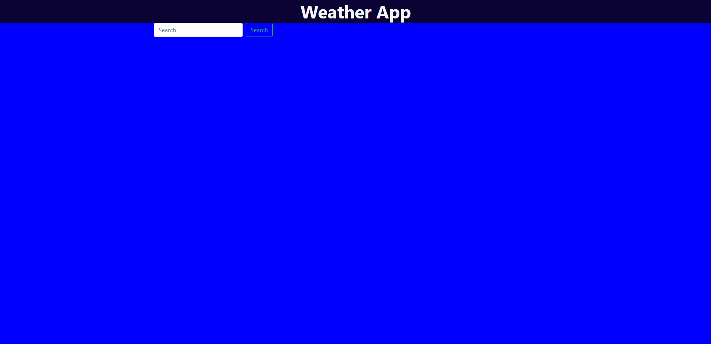
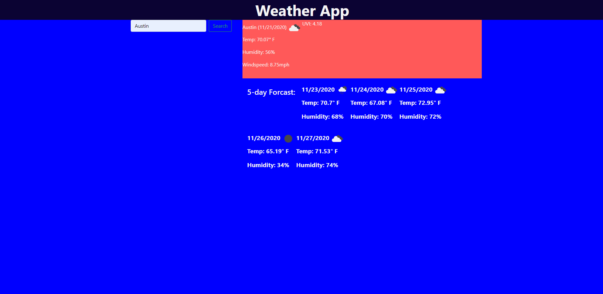

# Weather_app

## Pictures of the planner!

## Github pages 
https://github.com/Harrichas/Weather_app
https://harrichas.github.io/Weather_app/

## Langauges Used
API
HTML
JAVASCRIPT
CSS

## How to use the planner
search a city and it will show the current weather with the UVI as well as a 5 day forecast.